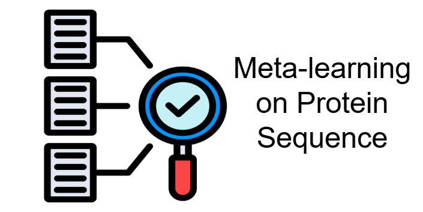

# Meta-Learning on Protein Mutation Sequence


<table>
<tr>
<td align="left" width="60%">
Welcome to the Meta-learning for Protein Mutate Property Difference Prediction repository! This repository corresponds to the meta-learning approach on Protein Mutation property predict project.
</td>
<td align="right" width="40%">

</td>
</tr>
</table>

## Getting Started

1. **Clone the Repository:**

   ```bash
   git clone https://github.com/kuku0202/maml.git
   cd maml
  
2. Create virtual environment to run this project:
    ```bash
    conda create -n maml python=3.9
    conda activate maml

3. **Install Required Packages:**

Ensure you have Python and pip installed. Then, install the necessary packages:

    pip install -r requirements.txt


4. **Download the model:**

To download the model, either:
  ```bash
  git lfs install
  git clone https://huggingface.co/yuesu4/Protein_Mutation_ProtBert_MAML
  ```
  or:
  ```bash
  from huggingface_hub import snapshot_download

  snapshot_download(repo_id="yuesu4/Protein_Mutation_ProtBert_MAML", local_dir="./")
  ```
Note: Make sure to install huggingface_hub if using option 2:
  ```bash
  pip install huggingface_hub
  ```
The  model from https://huggingface.co/yuesu4/Protein_Mutation_ProtBert_MAML should be saved in the saved_models directory for use with the pipeline.


## Usage
Run the full pipeline on all datasets:
```bash
python main.py --initial_task preprocess_data/combined_ddG_all.csv 
    --meta_learning_tasks preprocess_data/binding_affinity_train.csv preprocess_data/fireprot_dTm_train.csv preprocess_data/soluprotmut_solubility_train.csv 
    --test_tasks preprocess_data/binding_affinity_test.csv preprocess_data/fireprot_dTm_test.csv preprocess_data/soluprotmut_solubility_test.csv
    --finetune_train_tasks preprocess_data/binding_affinity_train.csv preprocess_data/fireprot_dTm_train.csv preprocess_data/soluprotmut_solubility_train.csv 
    --run_maml 
    --maml_epochs 50 
    --finetune_epochs 10
    --save_dir ./results
```

If you have downloaded the pretrained model from huggingface, you can skip the pretraining steps by adding:
```bash
python main.py --skip_pretrain --pretrained_model_path your_path_to_store_model_path
......
```

If you do not want to include target training part as tasks, there is an systematic approach to evaluate every task rather than run it one by one:
```bash
  python main.py --initial_task preprocess_data/combined_ddG_all.csv 
    --test_tasks preprocess_data/binding_affinity_test.csv preprocess_data/fireprot_dTm_test.csv preprocess_data/soluprotmut_solubility_test.csv 
    --maml_epochs 50 
    --finetune_epochs 10 
    --save_dir ./results
```